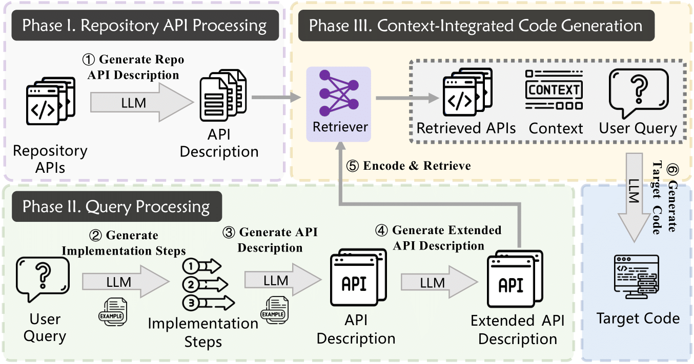

# 🚀 AllianceCoder: What to Retrieve for Effective Retrieval-Augmented Code Generation?   🔍 An Empirical Study and Beyond  

## 🌟 Overview  

🖥️ **AllianceCoder** consists of three key phases:  

  

### 📌 1. Repository API Processing  

✅ We utilize **large language models (LLMs)** to generate **natural language descriptions** for each API present in the repository.  
✅ These descriptions are then **encoded into vector representations** using pre-trained embedding models.  

### 📌 2. Query Processing  

🔍 We guide LLMs with **carefully designed examples** to generate **descriptions of potentially invoked API functionalities**.  
🔍 These descriptions are similarly **encoded into vector representations**.  

### 📌 3. Context-Integrated Code Generation 

🤖 **Relevant APIs are retrieved** based on the **cosine similarity** between their **vector representations**.  
🤖 The retrieved APIs provide **valuable context** for **enhanced code generation**.  

## 📂 Project Structure  

```md
|-- 📁 repo_funcs_summary   # 🛠️ First step: Extract and summarize repository functions
|
|-- 📁 ask_dependencies     # 🔗 Second step: Identify function dependencies
|
|-- 📁 similarity_retrieval  # 🔍 Third step: Retrieve the most relevant APIs
|-- 📁 function_list_buildup # 📜 Build a function list for further reference
|-- 📄 final_completion.py   # 🏗️ Generate complete code using retrieved APIs
|
|-- 🚀 run_pipeline.py       # ▶️ Execute the full pipeline
```

## ⚡ QuickStart

### 📝 1. Prepare the Input Files

📌 Ensure you have input.jsonl and the input repository structured correctly in the input folder.

### 📦 2. Install Dependencies

Run the following command to install all required packages:

```sh
pip install contexttimer flask transformers_stream_generator colorama accelerate python-Levenshtein tqdm sentence_transformers flash_attn
```

### ▶️ 3. Run the Pipeline

```sh
python run_pipeline.py
```
